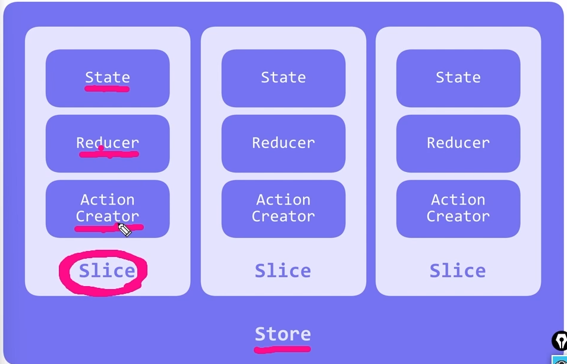

## install
- Redux導入
    既存のプロジェクトに導入
    ```
    npm install @reduxjs/toolkit
    ```
    React-Redux導入
    ```
    npm i react-redux
    ```

## storeの作成
- 1.Redux/toolkitでのstoreの作成
    srcディレクトリにstore.jsを作成
    下記を記述
    ```
    import { configureStore } from "@reduxjs/toolkit";
    export const store = configureStore({
        reducer:{},
    });
    ```
    storeの中に空のReducerを準備

    グローバルに使うにはstoreを持たせたProviderでラップする
    ```
    import { store } from './store';
    import { Provider } from 'react-redux';
      <React.StrictMode>
        <Provider store={store}>
        <App />
        </Provider>
      </React.StrictMode>
    ```
    ## Reducerを作成するためのsliceについて
    - Sliceとはstate,Reducer,Actionの3つをまとめたもの
    
    - 1.Sliceの作成
    srcディレクトリ内にfeaturesフォルダを作成しさらにその中にcartフォルダを作成
    cartフォルダ内にCartSlice.jsを作成
    ファイル名はパスカルケースで作成が主流
    name:"cart"はuseSelectorでアクセスする際に指定する
    initialStateは初期状態を入れる
    reducers
    ```
    import { createSlice } from "@reduxjs/toolkit";

    const cartSlice = createSlice({
    name:"cart",
    initialState,  
    })
    ```
    
    
    - 2.Reducerにsliceを渡す
    CartSlice.jsでsliceをexportする
    ```
    export default cartSlice.reducer
    ```
    store.jsでcartReducerを受け取る
    ```
    import { configureStore } from "@reduxjs/toolkit";
    import cartReducer from "./features/cart/CartSlice"

    export const store = configureStore({
    reducer:{
        cart: cartReducer
    },
    });
    ```
## ナビゲーションバーを作成
- 1.srcディレクトリにcomponentsフォルダを作成しNavbar.jsを作成
    ```
    import React from 'react'
    const Navbar = () => {
    return (
      <nav>
      <div className='nav-center'>
          <h3>Redux Shopping</h3>
          <div className='nav-container'>
              ロゴ
                <div className='amount-container'>
                  <p className='total-amount'>0</p>
                </div>          
          </div>
      </div>
      </nav>
    )
    }
    export default Navbar
    ```
    App.jsを下記のように書き換える
    ```
    import './App.css';
    import Navbar from './components/Navbar';
    function App() {
      return <main>
        <Navbar/>
      </main>
      ;
    }
    export default App;

    ```
## useSelectorでstoreにアクセスしよう
- 1.  分割代入で取得{amount}
  store.cartはオブジェクトとなる為、{}でamountの情報だけ取得する事が出来る
  ```
  const {amount} = useSelector((store)=> store.cart.amount)
  ```

## ロゴとボタンを準備
- 1.srcディレクトリにHeroIcons.jsを作成
  https://heroicons.com/
  使用したい画像のSVGをコピー
  returnの中に貼りつけ
  ボタンも同様のやりかた
  ```
  export const CartIcon =()=>{
    return(
        <svg xmlns="http://www.w3.org/2000/svg" fill="none" viewBox="0 0 24 24" stroke-width="1.5" stroke="currentColor" class="w-6 h-6">
  <path stroke-linecap="round" stroke-linejoin="round" d="M2.25 3h1.386c.51 0 .955.343 1.087.835l.383 1.437M7.5 14.25a3 3 0 0 0-3 3h15.75m-12.75-3h11.218c1.121-2.3 2.1-4.684 2.924-7.138a60.114 60.114 0 0 0-16.536-1.84M7.5 14.25 5.106 5.272M6 20.25a.75.75 0 1 1-1.5 0 .75.75 0 0 1 1.5 0Zm12.75 0a.75.75 0 1 1-1.5 0 .75.75 0 0 1 1.5 0Z" />
  </svg>
      )
  }
  ```
## 商品情報をローカルで定義
  - 1.srcフォルダ内にcartitems.jsを作成しshincodeのコードをそのままコピー
  ```
    const cartItems = [
    {
      id: 1,
      title: "Next.js入門講座",
      price: "12000",
      img: "https://uploda1.ysklog.net/uploda/3f3dc982dc.png",
      amount: 1,
    },
    {
      id: 2,
      title: "MERNスタックで本格的なSNSアプリ構築講座",
      price: "24000",
      img: "https://uploda1.ysklog.net/uploda/bf73156667.png",
      amount: 1,
    },
    {
      id: 3,
      title: "GraphQLとApollo入門講座",
      price: "8900",
      img: "https://uploda1.ysklog.net/uploda/9a99f8ca04.png",
      amount: 1,
    },
    {
      id: 4,
      title: "Three.jsでモダンウェブサイト構築講座",
      price: "14000",
      img: "https://uploda1.ysklog.net/uploda/59060b3cd3.png",
      amount: 1,
    },
    ];
    export default cartItems;
  ```

  - 2.CartSlice.jsでcartitems.jsを初期状態として使用する
  initialStateで取得することにより初期画面に表示できるようにする
  ```
  const initialState = {
    cartitems:cartItems,
    amount: 0,
    total: 0,
  };
  ```
## 取得してきた情報を出力するコンテナを作成
- 1.componentsフォルダにCartContainer.jsを作成しApp.jsにコンポーネントを表示
  ```
  import React from 'react'
  const CartContainer = () => {
  return (
    <div>CartContainer</div>
  )
  }

  export default CartContainer
  ```
- 2.CartContainerは商品がある時だけ表示したい為、if文を入力
  中身が入っていないときの記述
  ```
      if(amount < 1){
        return(
            <section className='cart'>
                <header>
                <h2>買い物かご</h2>
                <h4 className='empty-cart'>何も入ってないから</h4>
                </header>
            </section>
        )
    }
  ```
- 3.useselectorでamountのデータを取得
  分割代入で取得する方が後々取得しやすくなる
  ```
  const {amount,total} =useSelector((state)=>state.cart)
  ```
  分割代入を使わなければ下記のように記述しないといけなくなる
  ```
  const amount = useSelector((state)=> state.cart.amount)
  const  total = useSelector((state)=> state.cart.total)
  ```
- 4.商品がある時の記述
  divタグの中にマップ関数で展開
  (item)を一つずつ展開してCartItemコンポーネントで表示
  componentフォルダにCartItem.jsを作成
  keyの設定を行わないとwarningが出る
  cartitemsの中身は配列が4つある為、map関数が4回回る

  ```
      return(
    <section>
        <header>
            <h2>買い物かご</h2>
        </header>
        <div>
            {cartitems.map((item) => {
                return <CartItem key={item.id}/>;
            })}
        </div>
    </section>
    )
  ```
  footerで商品合計金額を記述
  totalをuseSelectorで取得し表示
  ```
          <footer>
            <hr/>
            <div className='cart-total'>
                <h4>
                合計 <span>{total}円</span>
                </h4>
            </div>
        </footer>
  ```
  全削除のボタンを追加
  ```
   <button className='btn clear-btn'>全削除</button>
  ```
  ## Storeの中身から商品情報を取り出して出力する
  - 1.CartItemコンポーネントを作成
    ひな形
    ```
    import React from 'react'
    const CartItem = () => {
    return <article className='cart-item'>
      
        <div>
          <h4> </h4>
        </div>
    </article>
    }
    export default CartItem
    ```
    cartitems.jsからタイトル等の情報を取得する
    その為に親コンポーネントのCartContainer.js内でpropsで渡す
    スプレット構文{...item}で記述
    cartitemsを一つ一つ取り出したものが(item)となっている
    これをスプレッド構文で展開している
    propsでの渡し方となる
    ```
    {cartitems.map((item) => {
    return <CartItem key={item.id}{...item}/>;
    })}
    ```
    一部分だけ取得したい場合は、下記のような記述になる
    ```
    {cartitems.map((item) => {
    return <CartItem key={item.id}title={item.title}/>;
    })}
    ```
    CartItemコンポーネントで受け取る
    cartitemsの格納した情報の中から取得する事が出来る
    ```
    const CartItem = ({id,img,title,price,amount}) => {
    return <article className='cart-item'>
      
        <div>
          <h4>{title}</h4>
          <h4 className='item-price'>{price}円</h4>
          <button className='remove-btn'>削除</button>
        </div>
        <div>
          <button className='amount-btn'>
            <PlusIcon/>
          </button>
          <p className='amount'>{amount}</p>
          <button className='amount-btn'>
            <MinusIcon/>
          </button>
        </div>
    </article>
    }
    ```
  ## 全ての商品を削除するActionとReducerを作成
    - 1.CartSlice.jsのReducerの中に記述する
    Sliceはstate,action,reducerをパックとしたようなものなので、新しいstateなどもここに作成する
    clearCartはアクションの名前
    今のstateの状態(state)をstate.cartItemsの中身を[]空にする
    dispatch通知をするときは、このclearCartを選べばstoreに通知する事が出来る
    
    ```
    const cartSlice = createSlice({
      name:"cart",
      initialState,
      reducers:{
        clearCart:(state) =>{
          state.cartItems = [];
          };
        },
      });
    ```
    Dispatchする為にエクスポートする
    ```
    export const {clearCart} = cartSlice.actions;
    ```

## Dispatchでstoreに通知して商品を削除する
  - CartContainer.jsでdispatch通知を出していく
  ReducerのclearCartをインポート
  全削除ボタンを押したら通知が出るようにする
  onClickの中にdispatchで中にclearCart関数を呼べば通知を出せる
  ```
      <button className='btn clear-btn' onClick={()=>dispatch(clearCart())}>全削除</button>
  ```
  この状態だと商品数であるamountが4のままとなる為、
  CartSlece.jsの中に下記の記述でinitialStateをcartitemsのみにする事が出来る
  ```
         clearCart:(state) =>{
            return{cartitems:[]}
        },
  ```
  上記だとなにも表示されない状態になる為、下記の記述とする
  ```
          clearCart:(state) =>{
            // state.cartitems = [];
            return{cartitems:[],amount:0,total:0}
        },
  ```

## 削除ボタンを押したら一つ一つ商品が削除されるReducerを作成
  Reducerはactioncreaterを作り、cartSlice.actionでexportしてあとでdispatchするという流れ
  - 1.CartSlice.jsでremoveItemという名前のReducerを作成
  第二引数でactionを受け取る
  このactionはtypeとpayloadを含む

    ```
            removeItem:(state,action) => {
            console.log(action)
        },
    ```
  - 2.CartItem.jsの削除ボタンにonClickを追加
  ```
  import { useDispatch } from 'react-redux'
  import { removeItem } from '../features/cart/CartSlice';
  const dispatch = useDispatch();
  <button className='remove-btn' onClick={()=>dispatch(removeItem(id))}>削除</button>
  ```
  3.CartSlice.jsで削除するロジックを作成
  filter関数を使って商品を削除する
  
  条件に対してtrueのものだけ残す
  
  このように!==とすることで取得したID以外を残すという処理になる
  結果削除ボタンが出来るという仕組み
  filter関数は商品のIDを比較して削除するということが必要となる為、
  削除ボタンを押した商品のIDを取得する必要がある
  const itemId = action.payloadでpayloadを見ていく
  cartItem.jsの削除ボタンを押した際のIDを取得する事が出来る
  ```
          removeItem:(state,action) => {
            // console.log(action)
            const itemId = action.payload;
            state.cartitems = state.cartitems.filter((item) => item.id !== itemId);}
  ```
## 購入する商品数を昇降させるReducerを作成
- 1.increaseというReducerを作成する
  cartItemという変数を準備カウントアップしていきたい商品を置いておくための変数
  カウントアップさせる商品を探すためにfind関数を使用
  find関数とは
  item.id === action.payloadこれがtrueであればそのtrueのものを新しい配列としてcartItemの中に入れるロジック

  state.cartitems.find((item) => item.id === action.payload);

```
        increase:(state,action) => {
            const cartItem = state.cartitems.find((item) => item.id === action.payload);
            cartItem.amount =cartItem.amount +1;

        },
```
cartitem.js＋ボタンにonClickを追加
```
 <button className='amount-btn' onClick={()=>dispatch(increase(id))}>
            <PlusIcon/>
        </button>
```
- 2.decrease　Reducerを作成
  increaseとロジックは同じで+を-にする
  ```
          decrease:(state,action) => {
            const cartItem = state.cartitems.find((item) => item.id === action.payload);
            cartItem.amount =cartItem.amount - 1;

        },
  ```
- 3.-1等のエラーのハンドリングを行う
  数字が0以下となればその商品を削除する
  if文でamountが1の時はそれ以降は消す必要がある為、removeitemのDispatchを通知し削除
  それ以外の時は、decreaseで-1にする
  ```
          <button className='amount-btn' onClick={()=>{
            if(amount === 1){
                dispatch(removeItem(id));
                return;
            }
            dispatch(decrease(id))
        }}>
                    <MinusIcon/>
        </button>
  ```
## 合計金額・商品数を管理するReducerを作成
  - 1.Reducerを作成
  今回はstateだけ用意
  商品の量amountと商品の合計の値段totalを管理する
  letで初期化して0に対してプラスしていく
  cartitemsの中身を見ていきforEachで一つ一つ取り出す
  取り出したものをitemという変数に持たせる
  初期化したamountに+=とし一つ一つ取り出したitem.amount
  合計の値段はamountに対してpriceを掛ける
  そして最新の状態にするために
  state.amountをamountに更新してあげる
  totalも同様
  ```
          calculateTotals:(state) => {
            let amount = 0;
            let total = 0;
            state.cartitems.forEach((item) => {
                amount += item.amount;
                total += item.amount * item.price;
            })
            state.amount = amount;
            state.total = total;
        },
  ```
  - 2.通知するタイミング
  calculateTotalsをDispatchする必要があるタイミングが多すぎる
  
  カート状態が変化する度に発火する仕組みを作る必要がある

## カート状態が変化する度に発火する仕組みを構築
- 1.useEffectを使用する
  useEffectは発火のタイミングを決めることが出きる
  カートの状態が減るもしくは増えるなどの状態が変化する度に発火させることができる
  useEffectの{}のところに,をつけ第二引数で[]を記述
  []に変数を入れる
  変数をいれるとその変数が変化した際に{}のロジックが発動するhooksとなる
  ```
    useEffect(() =>{
  },[])
  ```
  今回は[]の中にcartitemsの情報を入れてそれが変わるごとに発火するようにする
- 2.useSelectorで第二引数に入れるcartitemsを取得する
  ```
  const {cartitems} = useSelector((state) => state.cart);
  useEffect(() =>{

  },[cartitems])
  ```
- 3.useDispatchを作成
  dispatchでcalculateTotalsを通知する
  下記の方でエラー対応をしているが、今回の対処法は[]にdispatchを含めることで解除している
  ```
  const dispatch = useDispatch();
  const {cartitems} = useSelector((state) => state.cart);
  useEffect(() => {
    dispatch(calculateTotals())
  },[cartitems,dispatch])
  ```

  error
  ```
  React Hook useEffect has a missing dependency: 'dispatch'. Either include it or remove the dependency array.eslintreact-hooks/exhaustive-deps
  ```
  


## モーダル専用コンポーネントを作成
  - 1.モーダルウィンドウの作成
  componentsフォルダにModalファイルを作成
  htmlを作成
  ```
  import React from 'react'
  const Modal = () => {
  return (
   <aside className='modal-container'>
        <div className='modal'>
            <h4>買い物かごをすべて空にしますか？</h4>
            <div className='btn-container'>
                <button className='btn confirm-btn'>OK</button>
                <button className='btn clear-btn'>やめとく</button>
            </div>
        </div>
    </aside>
  )
  }
  export default Modal
  ```
  CSSのZ-indexでモーダルウィンドウ以外の操作を出来ないようにしている


## ModalSliceを作成
- featuresフォルダにmodalフォルダを作成しModalSlice.jsを作成
  slice作成手順振り返り
  1.createSliceをimport
  2.name,initialState,reducers{}を記述
  3.initialStateを記述 isOpen:falce
  4.reducersを作成
  5.action名を決めるopenModal (このアクション名は後々dispatchで通知する)
  6.(state,action)を受け取り
  7.state.isOpen = true;で今のisOpenの状態をtrueに変更する処理
  8.closeModalも同様の処理でfalseに変更
  9.exportする
  10.Reducerもexportする
  11.store.jsにmodalReducerを設定

  modalSlice.js
  ```
  import { createSlice } from "@reduxjs/toolkit"
  const initialState= {
    isOpen:false,
  };
  const modalslice = createSlice({
    name:"modal",
    initialState,
    reducers: {
        openModal: (state,action) =>{
            state.isOpen = true;
        },
        closeModal: (state,action) =>{
            state.isOpen = false;
        },
    },
  })
  export const {openModal,closeModal} = modalslice.actions
  export default modalslice.reducer;
  ```
  store.js
  ```
  import { configureStore } from "@reduxjs/toolkit";
  import cartReducer from "./features/cart/CartSlice"
  import modalReducer from "./features/modal/ModalSlice"
  export const store = configureStore({
    reducer:{
        cart: cartReducer,
        modal:modalReducer,
    },
  });
  ```

## 全削除を押してモーダルを出現させる
- 1.ModalSliceで作成したactionをDispatchする
  openModalをdispatchで通知する
  isOpenの状態にアクセスするにはuseSelectorを使用
  &&は{true &&　表示される}{falce && 表示されない}となる

  App.jsに記述
  isOpenがtrueであればModalコンポーネントを表示する記述
  ```
  const {isOpen} = useSelector((state)=> state.modal)
     {isOpen && <Modal/>}
  ```
  2.全削除ボタンにDispatchを記述
  cartcontainer.jsに記述
  ```
  <button className='btn clear-btn' onClick={()=>dispatch(openModal())}>全削除</button>
  ```

## 商品全削除ボタンとキャンセルボタンを実装
  Dispatchで通知する
  Modal.jsにてDispatchを設定
  OKボタンには2つのDispatchを準備
  複数のDispatchを持たせるには{}の中に記述する
  ```
   const dispatch = useDispatch();
     <button className='btn confirm-btn' onClick={()=>
                    {dispatch(clearCart());
                    dispatch(closeModal())
                    }}>
                     OK
                    </button>
                <button className='btn clear-btn' onClick={()=> dispatch(closeModal())}>やめとく</button>
  ```
## 

